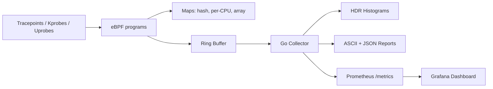

# Architecture

## Data path

1. Kernel-side eBPF programs emit structured events.
2. Ring buffer streams events with minimal copy overhead.
3. Userspace collector aggregates percentiles and heatmaps.
4. Snapshots are printed, optionally exported to JSON, and exposed as metrics.

## Maps

- `syscall_start`: tracks enter timestamps and syscall id.
- `sched_wakeup_ts`: tracks wakeup time by pid for run-queue latency.
- `filters`: runtime filters (`pid`, `comm`).
- `counters`: per-CPU diagnostics and drop counters.
